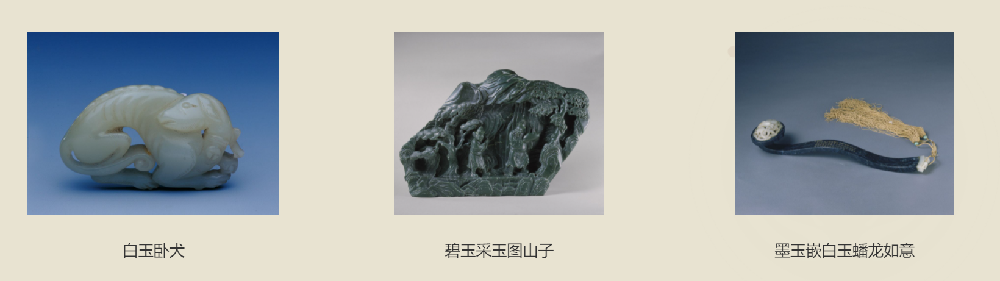
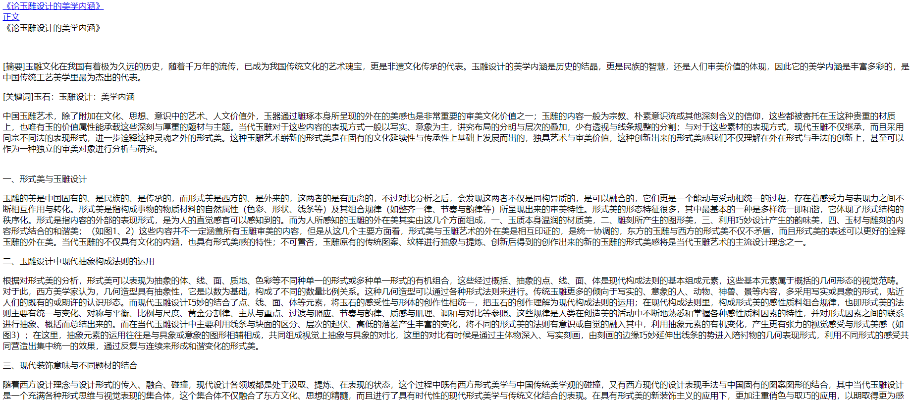

# Jade-WEB
## 配置环境
### Python版本 3.9
建议新建虚拟环境，以免发生冲突
### 导入必要的库
~~~
pip install -r requirements.txt
~~~
## 运行
打开app.py文件，命令行运行
~~~
python .\app.py
~~~
或者点击IDE中的运行按钮运行
## 停止运行
终端中ctrl+c
## 要做的工作(5.24更新)
### 把原先html中的超链接更改
举例说明  
welcome1.html
~~~html

    <a href="/index.html" class="button" target="_self">GO!</a>

~~~
这段代码应该修改为
~~~html

    <a href="/index" class="button" target="_self">GO!</a>

~~~
因为我为index.html配置的路由是/index  
所以这个工作不是简单地去掉.html，而是要和后端为该html配置的路由统一  
如何查看路由？  
打开app.py，找到网站对应的路由（就是去找哪里出现了index.html)
~~~python
@app.route('/index')
def index():
        return render_template('index.html')
~~~
route括号里的就是路由，也就是超链接里应该放的东西  
这段代码的意思是路由为/index时，用index.html渲染  
这样工作就是把跳转至.html改为跳转至html文件对应的路由  
### 配置正确的静态文件  
由于文件夹被重新整理了，现在需要使用 **相对路径** 去配置html的静态资源  
最终的目标是，直接在templates文件夹里双击打开时，要能成功加载所有静态资源
### 按照接口修改/编写html  
  
#### 目前需要修改的有
- index.html  
  原先index的我命名为index1了，所以麻烦再配置一下index的静态文件，我把路由跳转已经写好了。  
  接口有登入，登出，个人空间，进入论坛，请接在合理的位置上
- collection.html  
  接口是藏品的图片和名字，现在点击图片可以跳转至详情页，接口文件在collections.html里。如果不想更改后端可以把原文件的名字改成collections.html。如果不想更改原文件名，那么到后端文件把collections.html改成collection.html（下同，不再说明 )  
  
- Subjectx.x.html  
  这部分是一些文章，接口是文章的标题和正文。接口文件在read_articles.html。
  
#### 目前需要编写的有
- forum.html 论坛首页，就是进入论坛的页面
- forum_read.html 论坛阅读页，就是点进去一个帖子的页面
- forum_post.html 论坛发布页，就是发布一个帖子的页面
- profile.html
- collection_detail.html
- 其他在计划中的网页

